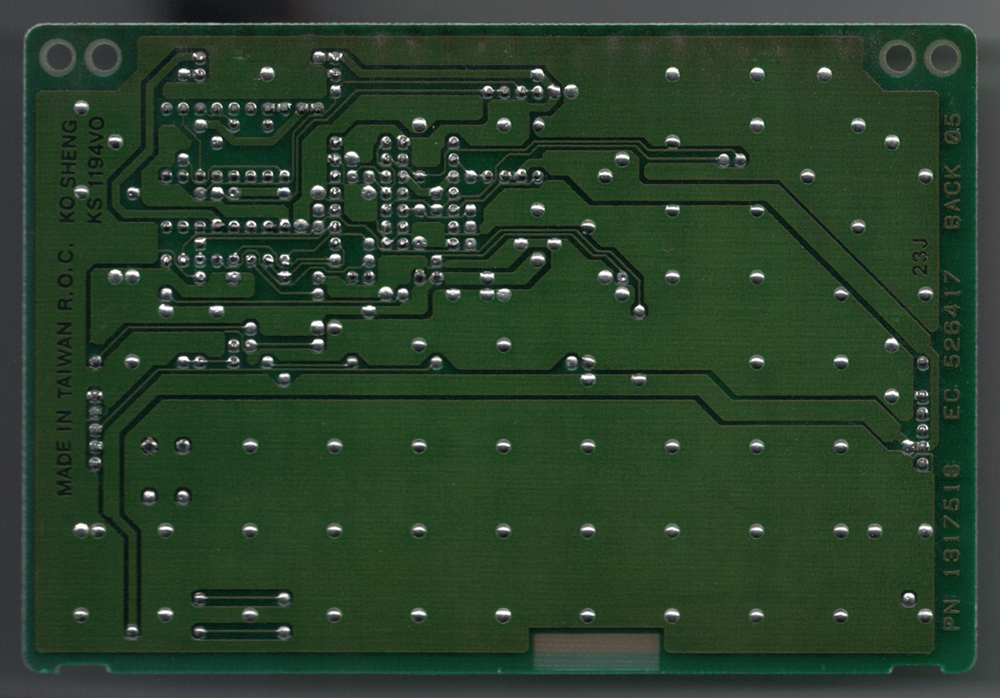

# Wheelwriter Interface Board

There are two versions of the Wheelwriter Interface Board. 
v1 ([schematic](wwib-v1/wwib-v1_schematic.pdf)) is the original prototype and 
was wired up on a solderless breadboard. This is what the code base was 
developed on as of 2024-08-19. This design is based on 
[tofergregg's](https://github.com/tofergregg/IBM-Wheelwriter-Hack) work.

v2 ([schematic](wwib-v2/WheelwriterInterfaceBoard_schematic.pdf)) was designed 
to be a fabricated PCB and be the same size as the original Wheelwriter 
expansion boards, fit in the original expansion housing, and connect to the 
Wheelwriter expansion interface connector. This design has and isolated power 
supply and bus interface and is powered by the typewriter instead of the 
Arduino's USB port. As of 2024-08-19, this v2 design has been fabbed but not 
assembled.

## Original Wheelwriter expansion board
Image of the back of the board

