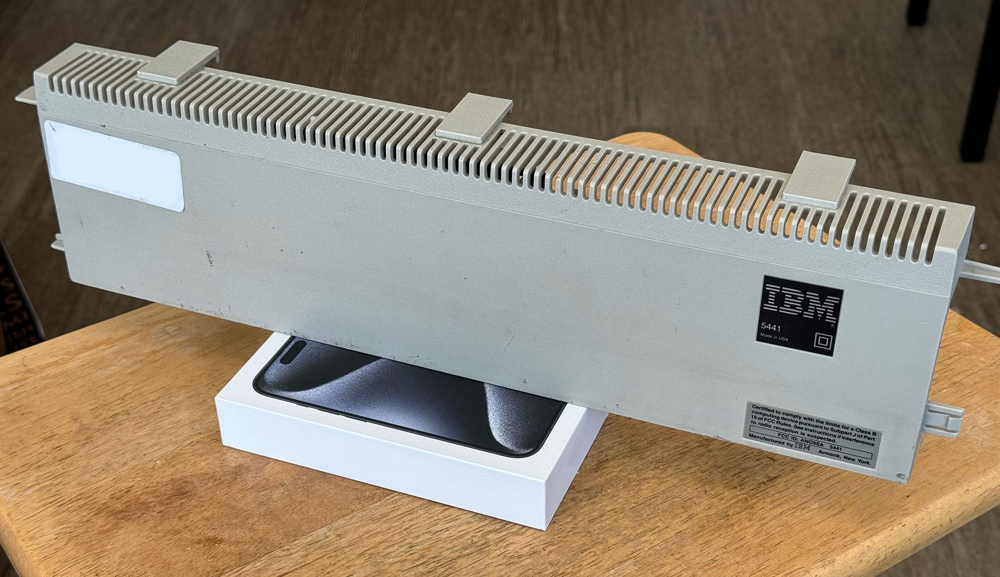
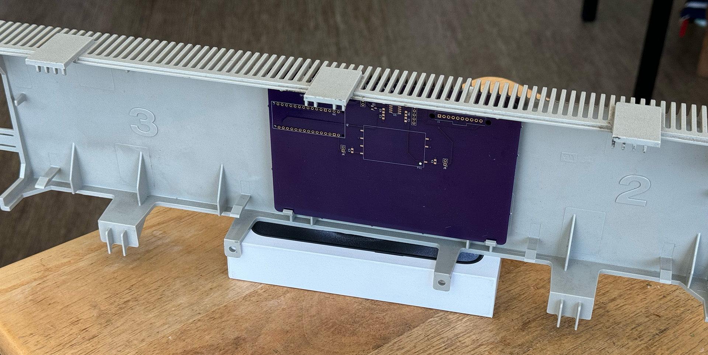

# Wheelwriter Interface Board

There are two versions of the Wheelwriter Interface Board. 

## v1 - Prototype breadboard
v1 ([schematic](wwib-v1/wwib-v1_schematic.pdf)) is the original prototype and 
was wired up on a solderless breadboard. This is what the code base was 
developed on as of 2024-09-21. This design is based on 
[tofergregg's](https://github.com/tofergregg/IBM-Wheelwriter-Hack) work.

## v2 - Expansion housing PCB
v2 ([schematic](wwib-v2/WheelwriterInterfaceBoard_schematic.pdf)) was designed 
to be a fabricated PCB and be the same size as the original Wheelwriter 
expansion boards, fit in the original expansion housing, and connect to the 
Wheelwriter expansion interface connector via a cable. This design has and 
isolated power supply and bus interface and is powered by the typewriter 
instead of the Arduino's USB port. 

*As of 2024-09-21, this v2 design has been fabbed but not assembled, nor tested!*

### Expansion cable
The expansion port on the Wheelwriter is a Molex SL series 10-pin shrouded 
header. A short cable needs to be built to connect the Wheelwriter expansion 
port to this interface board. A mating connector is Molex 50-57-9210 
(70066-0079). Contacts for 22-24 AWG wire are Molex 16-02-0102 (70058-0222). 

This design only uses +5V (pins 1, 2), GND (pins 3, 4), and BUS (pin 5). The 
rest are only for testing.

### v2 mounted in expansion housing

## Reference
### Original Wheelwriter expansion board
Image of the back of the board

